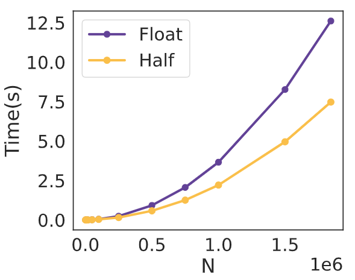
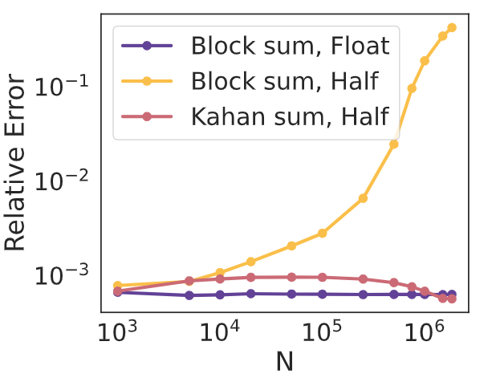
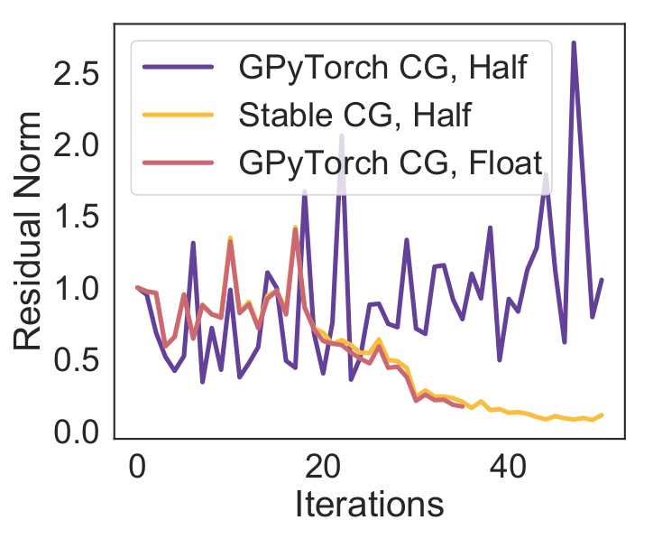
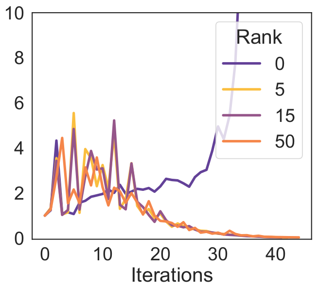
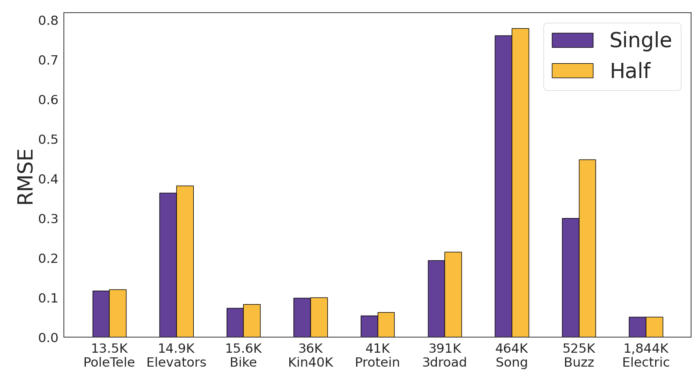
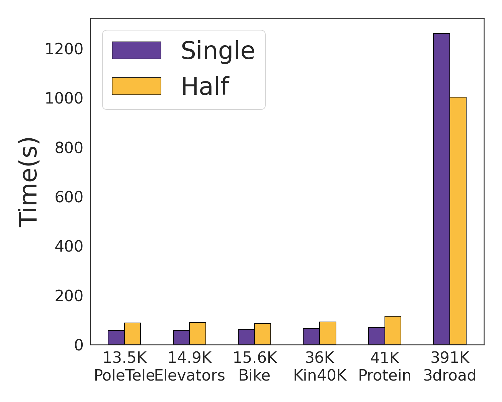
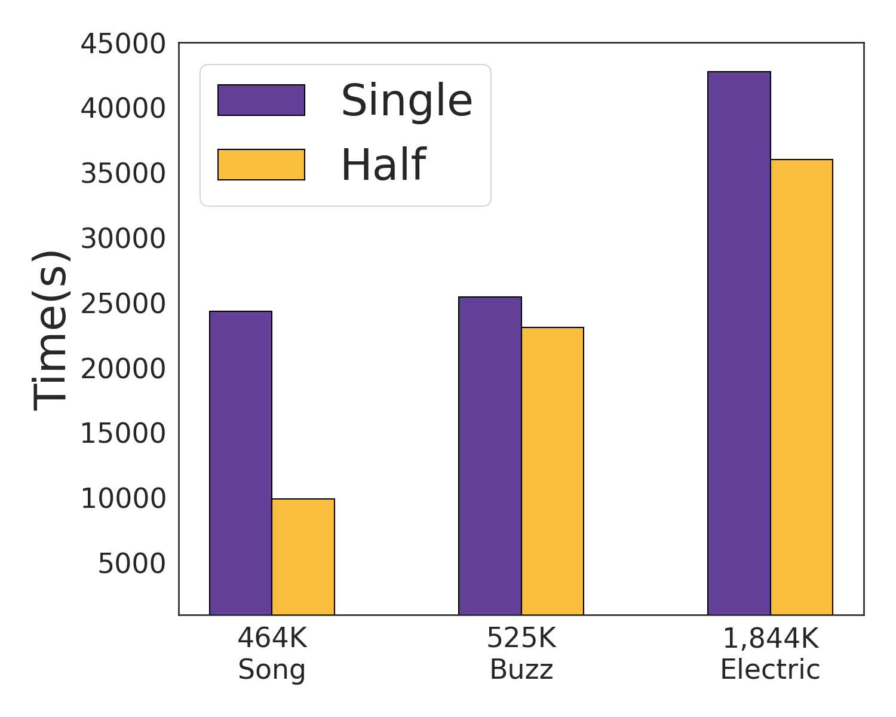

# Low Precision Arithmetic for Fast Gaussian Processes

This repository contains PyTorch code for the UAI 2022 paper

[Low Precision Arithmetic for Fast Gaussian Processes](https://openreview.net/pdf?id=S3NOX_Ij9xc)

by Wesley J. Maddox\*, Andres Potapczynski\*, and Andrew Gordon Wilson. 

## Introduction

In this paper, **we show how to make Gaussian processes faster, while retaining accuracy**, by developing methods for **low-precision computation**.

These methods involve a modification to conjugate gradients with re-orthogonalization, compact kernels, pre-conditioners, and mixed-precision representations. In many cases, these approaches can be used as a **drop-in replacement** for standard Gaussian process routines, or combined with other scalable inference approaches. In short, you should try this out! 

In order to make predictions with Gaussian processes, we need to solve linear systems. Matrix multiplications are the computational bottleneck for iterative approaches like conjugate gradients. We see below that low-precision techniques enable substantially faster matrix vector multiplies, without sacrificing accuracy. However, just naively casting everything into half-precision does not provide good results. The details such as the summation startegy can have a big effect on accuracy. We use Kahan summation.

<p align="center">
  
  
</p>

We also propose special modifications of CG for stability in low precision, and use pre-conditioning. Pre-conditioning can make a big difference over no-preconditioning, but a low-rank pre-conditioner often suffices.

<p align="center">
  
  
</p>


With these modifications, we see the RMSE for GP predictions using single and half precision are comparable over a wide range of datasets.

<p align="center">
  
</p>

And the training time can be substantially better in half precision for large datasets (e.g., 10000s vs 25000s). For smaller datasets, the runtimes are comparable, though half precision can be slightly slower (e.g., 200s vs 150s). There are two reasons that can cause half precision to run slower: (1) we use KeOps for matrix multiplies, which has a longer compilation time in half precision; (2) higher round-off error can mean more CG steps are required to reach a desired tolerance. The fixed cost of (1) can become apparent on small datasets.

<p align="center">
  
  
</p>

## Citation

Please cite our work if you find it useful:

```bibtex
@inproceedings{gplowprec2022,
  title={Low precision arithmetic for fast Gaussian processes},
  author={Maddox, Wesley J and Potapczynski, Andres and Wilson, Andrew Gordon},
  booktitle={Uncertainty in Artificial Intelligence},
  year={2022}
}
```

## Installation instructions
* For Bayesian Benchmarks do not use the setup.py file. Instead (1) git clone the repo, (2) add the repo to the PYTHONPATH (needed for properly loading modules on the repo)
* Create a `logs` directory.

## Requirements
The requirements can be found on `requirements.txt`, the most important being: 
* [PyTorch](http://pytorch.org/)
* [GPyTorch](https://gpytorch.ai/)
* [Botorch](https://botorch.org/)
* [PyKeops](https://www.kernel-operations.io/keops/introduction/why_using_keops.html)

## File Structure
```
.

├── core (contains all the different CG solvers)
│   ├── gpytorch_cg_log_native.py
│   ├── gpytorch_cg_native.py
│   ├── gpytorch_cg.py
│   ├── gpytorch_cg_re.py
│   ├── gpytorch_log_cg.py
│   ├── gpytorch_log_cg_re.py
├── experiments (contains the code to run the experiments from terminal)
│   ├── models.py
│   ├── optim.py
│   └── runner.py
├── logs (folder to log results)
├── mlls (contains the Marginal Log Likelihood)
│   └── mixedpresmll.py
├── notebooks (contains examples)
│   └── Running_CG.ipynb
├── README.md
├── requirements.txt
├── results
└── utils (contains general utils for ploting, printing)
    ├── general.py
    ├── linear_log_re_cg.py
```

## Experiments
To replicate the experimental results you can run

```shell
python3 experiments/runner.py \
    --dataset=wilson_pol \
    --mll=mixed \
    --sample_size=-1 \
    --max_cg_iterations=50 \
    --num_random_probes=10 \
    --cg_tolerance=1.0 \
    --eval_cg_tolerance=0.01 \
    --precond_size=15 \
    --device=0 \
    --split=73 \
    --kernel=matern \
    --nu=0.5 \
    --ard \
    --rel_tol=-1000 \
    --seed=0 \
    --maxiter=50 \
    --database_path=. \
    --root_decomp=100 \
    --with_adam
```

## Variables / Arguments Explanation
| Name | Description |
| :------------ |  :-----------: |
| `dataset` | Specifies dataset to use. |
| `mll` | Selects the marginal likelihood model. |
| `sample_size` |  Number of observations to use (set to -1 for full dataset). |
| `max_cg_iterations` |  Maximum number of CG iterations. |
| `num_random_probes` |  Number of random probes to estimate the loss. |
| `cg_tolerance` |  Tolerance that CG must reach during training. |
| `eval_cg_tolerance` |  Tolerance that CG must reach during testing. |
| `precond_size` |  Preconditioner rank. |
| `device` |  Which GPU device to use (set to 0 if default). |
| `split` |  Set random seed to use (set an int). |
| `kernel` | Select that type of kernel to use. |
| `nu` |  If using Matern, determine if 0.5, 1.5 or 2.5. |
| `ard` |  Flag to use ARD. |
| `rel_tol` | Relative tolerance to stop the optimization (set to -1000 to ignore). |
| `maxiter` | Maximum number of optimization steps. |
| `database_path` |  Path to save results. |
| `with_adam` |  Flag for using ADAM as an optimizer. |

## Examples
```shell
## Run Matern 1/2 ARD on Bike
  python3 experiments/gpytorch_bb/runner.py --dataset=wilson_bike --mll=mixed --sample_size=-1 --max_cg_iterations=50 --num_random_probes=10 --cg_tolerance=1.0 --precond_size=15 --device=0 --dtype=float --split=73 --kernel=matern --nu=0.5 --ard --rel_tol=-1000 --seed=0 --maxiter=50 --database_path=.  --root_decomp=100 --with_adam --eval_cg_tolerance=0.01
```

```shell
## Run RBF ARD on 3dRoad
python3 experiments/gpytorch_bb/runner.py --dataset=wilson_3droad --mll=remixed --sample_size=-1 --max_cg_iterations=25 --num_random_probes=10 --cg_tolerance=1.0 --precond_size=25 --device=0 --dtype=float --split=5934 --kernel=rbf --ard --rel_tol=-1000 --seed=0 --maxiter=30 --database_path=.  --root_decomp=100 --with_adam --eval_cg_tolerance=0.01
```

```shell
## Run RBF no ARD on PoleTele
 python3 experiments/gpytorch_bb/runner.py --dataset=wilson_pol --mll=remixed --sample_size=-1 --max_cg_iterations=25 --num_random_probes=10 --cg_tolerance=1.0 --precond_size=25 --device=0 --dtype=float --split=21 --kernel=rbf --rel_tol=-1000 --seed=0 --maxiter=30 --database_path=.  --root_decomp=100 --with_adam --eval_cg_tolerance=0.01
```

## Notebooks
In `notebooks` you can also find an example of how to run the CG solvers.
