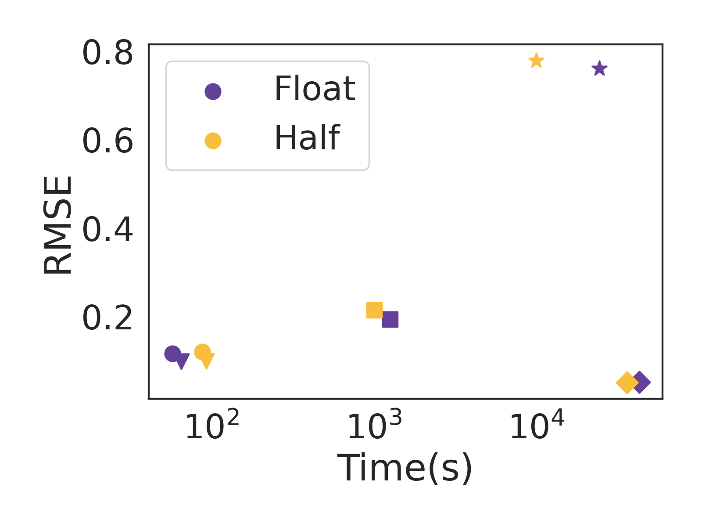

# Low Precision Arithmetic for Fast Gaussian Processes

This repository contains PyTorch code for for the paper

[Low Precision Arithmetic for Fast Gaussian Processes](https://openreview.net/pdf?id=S3NOX_Ij9xc)

by Wesley J. Maddox\*, Andres Potapczynski\*, and Andrew Gordon Wilson. 

## Introduction

In this paper, we show how to speed up Gaussian processes by representing numbers in lower precision, while retaining accuracy. These methods involve a modification to conjugate gradients with re-orthogonalization, compact kernels, pre-conditioners, and mixed-precision representations. In many cases, these approaches can be used as a drop-in replacement for standard Gaussian process routines, or combined with other scalable inference approaches. In short, you should try this out! 
The right plot contains the comparison of GPs trained on different UCI datasets of
various sizes and the left plot the reduction in MVM time when using half.

<p align="center">
  
  
</p>


Half precision does not work as-is. We defined a stable version of CG that uses
preconditioning.
<p align="center">
  
  
</p>

Please cite our work if you find it useful:

```bibtex
@inproceedings{gplowprec2022,
  title={Low precision arithmetic for fast Gaussian processes},
  author={Maddox, Wesley J and Potapczynski, Andres and Wilson, Andrew Gordon},
  booktitle={Uncertainty in Artificial Intelligence},
  year={2022}
}
```

## Installation instructions
* For Bayesian Benchmarks do not use the setup.py file. Instead (1) git clone the repo, (2) add the repo to the PYTHONPATH (needed for properly loading modules on the repo)
* Create a `logs` directory.

## Requirements
The requirements can be found on `requirements.txt`, the most important being: 
* [PyTorch](http://pytorch.org/)
* [GPyTorch](https://gpytorch.ai/)
* [Botorch](https://botorch.org/)
* [PyKeops](https://www.kernel-operations.io/keops/introduction/why_using_keops.html)

## File Structure
```
.

├── core (contains all the different CG solvers)
│   ├── gpytorch_cg_log_native.py
│   ├── gpytorch_cg_native.py
│   ├── gpytorch_cg.py
│   ├── gpytorch_cg_re.py
│   ├── gpytorch_log_cg.py
│   ├── gpytorch_log_cg_re.py
├── experiments (contains the code to run the experiments from terminal)
│   ├── models.py
│   ├── optim.py
│   └── runner.py
├── logs (folder to log results)
├── mlls (contains the Marginal Log Likelihood)
│   └── mixedpresmll.py
├── notebooks (contains examples)
│   └── Running_CG.ipynb
├── README.md
├── requirements.txt
├── results
└── utils (contains general utils for ploting, printing)
    ├── general.py
    ├── linear_log_re_cg.py
```

## Experiments
To replicate the experimental results you can run

```shell
python3 experiments/runner.py \
    --dataset=wilson_pol \
    --mll=mixed \
    --sample_size=-1 \
    --max_cg_iterations=50 \
    --num_random_probes=10 \
    --cg_tolerance=1.0 \
    --eval_cg_tolerance=0.01 \
    --precond_size=15 \
    --device=0 \
    --split=73 \
    --kernel=matern \
    --nu=0.5 \
    --ard \
    --rel_tol=-1000 \
    --seed=0 \
    --maxiter=50 \
    --database_path=. \
    --root_decomp=100 \
    --with_adam
```

## Variables / Arguments Explanation
| Name | Description |
| :------------ |  :-----------: |
| `dataset` | Specifies dataset to use. |
| `mll` | Selects the marginal likelihood model. |
| `sample_size` |  Number of observations to use (set to -1 for full dataset). |
| `max_cg_iterations` |  Maximum number of CG iterations. |
| `num_random_probes` |  Number of random probes to estimate the loss. |
| `cg_tolerance` |  Tolerance that CG must reach during training. |
| `eval_cg_tolerance` |  Tolerance that CG must reach during testing. |
| `precond_size` |  Preconditioner rank. |
| `device` |  Which GPU device to use (set to 0 if default). |
| `split` |  Set random seed to use (set an int). |
| `kernel` | Select that type of kernel to use. |
| `nu` |  If using Matern, determine if 0.5, 1.5 or 2.5. |
| `ard` |  Flag to use ARD. |
| `rel_tol` | Relative tolerance to stop the optimization (set to -1000 to ignore). |
| `maxiter` | Maximum number of optimization steps. |
| `database_path` |  Path to save results. |
| `with_adam` |  Flag for using ADAM as an optimizer. |

## Examples
```shell
## Run Matern 1/2 ARD on Bike
  python3 experiments/gpytorch_bb/runner.py --dataset=wilson_bike --mll=mixed --sample_size=-1 --max_cg_iterations=50 --num_random_probes=10 --cg_tolerance=1.0 --precond_size=15 --device=0 --dtype=float --split=73 --kernel=matern --nu=0.5 --ard --rel_tol=-1000 --seed=0 --maxiter=50 --database_path=.  --root_decomp=100 --with_adam --eval_cg_tolerance=0.01
```

```shell
## Run RBF ARD on 3dRoad
python3 experiments/gpytorch_bb/runner.py --dataset=wilson_3droad --mll=remixed --sample_size=-1 --max_cg_iterations=25 --num_random_probes=10 --cg_tolerance=1.0 --precond_size=25 --device=0 --dtype=float --split=5934 --kernel=rbf --ard --rel_tol=-1000 --seed=0 --maxiter=30 --database_path=.  --root_decomp=100 --with_adam --eval_cg_tolerance=0.01
```

```shell
## Run RBF no ARD on PoleTele
 python3 experiments/gpytorch_bb/runner.py --dataset=wilson_pol --mll=remixed --sample_size=-1 --max_cg_iterations=25 --num_random_probes=10 --cg_tolerance=1.0 --precond_size=25 --device=0 --dtype=float --split=21 --kernel=rbf --rel_tol=-1000 --seed=0 --maxiter=30 --database_path=.  --root_decomp=100 --with_adam --eval_cg_tolerance=0.01
```

## Notebooks
In `notebooks` you can also find an example of how to run the CG solvers.

## Results
*Below we have the RMSEs, NLLs and training times* with $\pm$ the standard deviation over 5
different seeds. We ran a suite of UCI tasks for half and single precisions GPs and
SVGPs.

| Dataset | $(N, d)$ | RMSE (single) | RMSE (half) | Time (single) | Time (half) |
| ---     | ---      | ---           |  ---        | ---           | --- |
| PoleTele  | (13.5K, 26)  | 0.117  $\pm$ 0.004 | 0.121 $\pm$ 0.003 | 57.6 $\pm$ 0.6  | 88.3 $\pm$ 3.2 |
| Elevators | (14.9K, 18)  | 0.364  $\pm$ 0.004 | 0.382 $\pm$ 0.001 | 58.4 $\pm$ 3.1  | 90.1 $\pm$ 2.9 |
| Bike      | (15.6K, 17)  | 0.074  $\pm$ 0.003 | 0.083 $\pm$ 0.009 | 62.3 $\pm$ 0.7  | 85.6 $\pm$ 0.41 |
| Kin40K    | (36K, 8)     | 0.099  $\pm$ 0.001 | 0.100 $\pm$ 0.003 | 65.5 $\pm$ 5.3  | 92.9 $\pm$ 0.28 |
| Protein   | (41.1K, 9)   | 0.055  $\pm$ 0.006 | 0.635 $\pm$ 0.002 | 70.0 $\pm$ 5.7  | 115.7 $\pm$ 0.10 |
| 3droad    | (391.4K, 3)  | 0.194  $\pm$ 0.010 | 0.215 $\pm$ 0.004 | 1,260 $\pm$ 35  | 1,003 $\pm$ 0.97 |
| Song      | (463.8K, 90) | 0.761  $\pm$ 0.004 | 0.779 $\pm$ 0.022 | 24,357 $\pm$ 2,613 | 9,930 $\pm$ 130 |
| Buzz      | (524.9K, 77) | 0.300  $\pm$ 0.010 | 0.448 $\pm$ 0.004 | 25,436 $\pm$ 1,200 | 23,127 $\pm$ 1,819 |
| HouseElectric | (1,844.3K, 9) | 0.052  $\pm$ 0.002 | 0.051 $\pm$ 0.004 | 42,751 $\pm$ 2,180 | 36,025 $\pm$ 1,178 |

In terms of training time, *it is important to note that half precision can take more than
single precision for two reasons*: (1) the KeOps compilations times are almost double in
half (this will improve in the future) and (2) the higher round-off error in
mixed-precision CG implies a longer number of steps in order to reach the required
tolerances.
